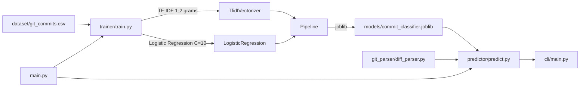

# Git Commit Predictor

Multi-class commit message classification using TF-IDF and Logistic Regression. Trains on historical git commit data to predict commit message categories from diff content.

## Overview

Predicts commit message categories from code diffs. Trains a scikit-learn pipeline on historical commit data stored as CSV, serializes the model to joblib, and exposes a CLI for inference.

## Core Architecture



## System Components

| Component | Responsibility |
|---|---|
| `git_parser/diff_parser.py` | Parses git diffs into feature text |
| `trainer/train.py` | Loads CSV, trains TF-IDF + LogisticRegression pipeline, saves joblib |
| `predictor/predict.py` | Loads model, classifies new diffs with confidence |
| `cli/main.py` | Command-line interface for training and prediction |
| `main.py` | Entry point orchestrating demo predictions |

## Technology Stack

| Layer | Technology | Purpose |
|---|---|---|
| Language | Python 3.8+ | Core implementation |
| ML | scikit-learn | TF-IDF vectorization, Logistic Regression |
| Serialization | joblib | Model persistence |
| Data | CSV + pandas | Training data |

## Requirements

- Python 3.8+
- pip

## Configuration

| File | Purpose |
|---|---|
| `requirements.txt` | Python dependencies |
| `dataset/git_commits.csv` | Training data (gitignored) |

## Getting Started

```bash
cd git-commit-predictor
pip install -r requirements.txt
python main.py                        # Train (if model missing) + demo
python -m cli.main "Added user auth"  # CLI prediction
```
